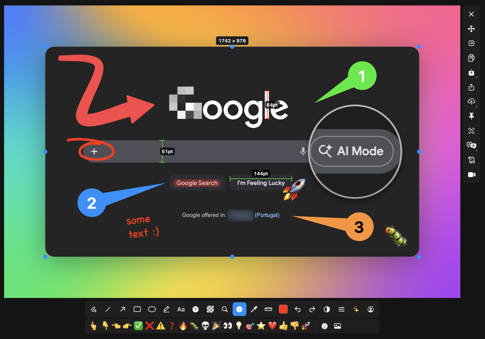
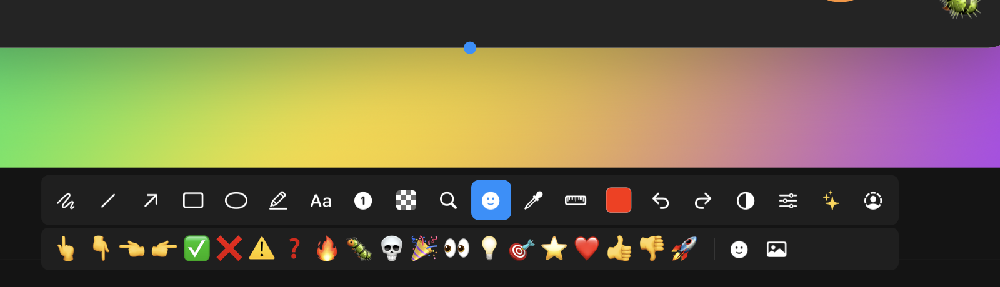

# SnapPii

中文说明在前，完整 English reference follows below.

## 中文

SnapPii 是一款面向 macOS 的截图工具，提供区域选择、窗口吸附、截图标注、剪贴板与文件输出，以及按应用自动切换输入法。

### 功能

- 使用 `Command + Shift + 4` 全局快捷键唤起截图。
- 支持区域选择、窗口吸附、内联标注和独立编辑。
- 可选择仅复制、仅保存、复制并保存或进入编辑器。
- 支持连续截图：多次截取后保存在临时托盘中，确认后一次复制多张独立图片；在 Word 或支持多项目剪贴板的聊天输入框中按一次 `Command + V` 即可按顺序粘贴。
- 支持 PNG/JPEG、默认保存目录、截图提示音、菜单栏驻留和浅色/深色/跟随系统主题。
- 支持全局默认输入法与按应用覆盖规则。

### 界面预览

截图与标注工作流：



常用标注、形状、文本、编号、颜色与表情工具：



### 快速开始

要求：macOS 14 或更高版本、Xcode（含 macOS SDK）和 XcodeGen。

```bash
brew install xcodegen
make generate
./script/build_and_run.sh
```

运行全部测试：

```bash
make test
```

### 权限

截图需要在“系统设置 -> 隐私与安全性 -> 屏幕与系统音频录制”中授权。输入法自动切换及部分窗口交互需要辅助功能权限。

## English

SnapPii is a personal macOS screenshot utility for MacBook Air M4. It combines a `macshot`-style capture and annotation overlay with this app's own settings UI, output routing, menu bar behavior, hotkeys, and input source automation.

## Features

- macOS screenshot overlay based on imported `macshot` core code.
- Region selection, window snapping, and inline annotation toolbar.
- Screenshot output preferences for clipboard-only, save-only, copy-and-save, or edit-first workflows.
- Configurable default save directory, defaulting to the Desktop.
- Global screenshot shortcut: `Command + Shift + 4`.
- Batch capture tray: take several screenshots, then copy all of them as independent images for one paste into Word or compatible chat inputs.
- App-wide theme setting: light, dark, or follow system.
- Optional menu bar icon while keeping background residency.
- Input source automation with a global default and per-app overrides.

## Output Boundary

- Clipboard-only screenshots are copied to the system clipboard only. SnapPii does not write a saved image, preview cache image, or main-window history item for that action.
- Batch captures are retained as temporary PNG files until the next batch session, then copied as ordered, independent pasteboard items.
- Save-only and copy-and-save screenshots write image files to the configured default save directory. The default directory is the Desktop.
- Edit-first screenshots remain in the annotation overlay until the user explicitly chooses copy, save, share, or another toolbar action.

## Project Structure

- `ScreenshotTool/`: main SwiftUI/AppKit macOS app.
- `MacShotCore/`: bridge framework and imported `macshot` screenshot core.
- `ScreenshotToolTests/`: app-level unit tests.
- `MacShotCoreTests/`: screenshot core unit tests.
- `project.yml`: XcodeGen project definition.
- `script/build_and_run.sh`: local build and run helper.

## macshot Usage Scope

The screenshot engine is built around source imported from the local `macshot` project at `/Users/nic/Documents/workspace/screenshot/macshot`. Imported and modified files live under `MacShotCore/Imported`, with a small bridge layer in `MacShotCore/`.

The app currently uses these `macshot`-derived technologies:

| Area | `macshot` technology used in this project |
| --- | --- |
| Screen capture | ScreenCaptureKit-based full-screen and window capture, including multi-display capture and overlay-window exclusion. |
| Capture overlay | AppKit overlay windows, region selection, resize handles, border dragging, window snapping, and keyboard-driven capture actions. |
| Annotation canvas | `OverlayView`, annotation state, hit testing, undo/redo support, selection movement, resize/delete/edit behavior, and composited image export. |
| Annotation tools | Arrow, line, rectangle, filled rectangle, ellipse, pencil, marker, text, number, pixelate/blur, measure, loupe, stamp, and color sampling tool handlers. |
| Toolbar and popovers | Floating annotation toolbar, tool option rows, color/font/effects/emoji/gradient/list popovers, and toolbar feature gating. |
| Image utilities | Image encoding, image effects, beautify rendering, OCR helper, barcode detection, filename formatting, temporary share files, and language helper utilities where needed by the imported core. |
| Preferences bridge | `MacShotPreferencesAdapter` maps SnapPii settings into the `UserDefaults` keys expected by the imported `macshot` core. |

The app intentionally does not use `macshot` as a whole application. SnapPii keeps its own SwiftUI settings UI, main window, save-directory ownership, output routing, menu bar behavior, app theme settings, hotkey ownership, GitHub workflow, and input source automation. Some imported `macshot` features that are outside the current screenshot path are disabled or shimmed in `MacShotCore/Imported/MacShotFeatureShims.swift`.

## Requirements

- macOS 14 or later.
- Xcode with macOS SDK installed.
- XcodeGen for regenerating `ScreenshotTool.xcodeproj`.

Install XcodeGen if needed:

```bash
brew install xcodegen
```

## Build And Run

Generate the Xcode project:

```bash
make generate
```

Build and launch the app:

```bash
./script/build_and_run.sh
```

Build and verify that the process starts:

```bash
./script/build_and_run.sh --verify
```

Run tests:

```bash
make test
```

Run a single test target or test file path:

```bash
make test-only TEST=MacShotCoreTests/OverlayWindowControllerTests
```

## Local Deployment

For manual permission testing, build the app and copy the same app bundle into `/Applications`:

```bash
pkill -x SnapPii
./script/build_and_run.sh --verify
rm -rf /Applications/SnapPii.app
cp -R .build/xcode/Build/Products/Debug/SnapPii.app /Applications/SnapPii.app
open -n /Applications/SnapPii.app
```

macOS privacy permissions are tied to the app's bundle identifier and code signing identity. The build and DMG scripts try to sign with a stable Apple identity in this order:

- `SNAPPII_CODESIGN_IDENTITY`, when explicitly set.
- `Developer ID Application`, for Release builds.
- `Apple Development`, for Debug builds.

If no Apple signing identity is installed, the scripts continue with the app produced by Xcode and print a warning. In that fallback mode macOS may treat each rebuild as a new app, so Screen Recording or Accessibility authorization can need to be granted again.

To check local signing identities:

```bash
security find-identity -p codesigning -v
```

To force a specific identity:

```bash
SNAPPII_CODESIGN_IDENTITY="Apple Development: Your Name (TEAMID)" ./script/build_and_run.sh --verify
SNAPPII_CODESIGN_IDENTITY="Developer ID Application: Your Name (TEAMID)" ./script/package_dmg.sh
```

## Permissions

Screenshot capture needs Screen Recording permission:

`System Settings -> Privacy & Security -> Screen & System Audio Recording`

Input source automation and some window interactions need Accessibility permission:

`System Settings -> Privacy & Security -> Accessibility`

The app includes a diagnostics page that shows the current permission state and the running bundle path.

## License Notice

`MacShotCore` incorporates and modifies GPLv3-licensed source from the local `macshot` project. Keep `MacShotCore/LICENSE.macshot-GPLv3.txt` and `MacShotCore/NOTICE.md` with source or binary distributions.
